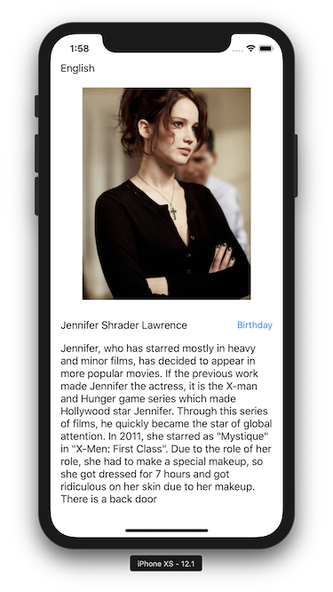

# swift - universalapp

# Step1
> iPad / iPhone 기기별 구분하기

### 작업
1. iPad 용 스토리보드 추가
2. main 스토리보드 -> iPhone 용 스토리보드로 변경
3. Info.plist 에서 iPad / iPhone 별 storyboard target 설정

### 첨부파일

### 참고
[Xcode 6 Separate Storyboard for iPad and iPhone – iRawd](https://irawd.wordpress.com/2014/10/21/xcode-6-separate-storyboard-for-ipad-and-iphone/)

# Step2
> 앱 지역화

### 작업
1. Project > info > Localizations 에 각 언어 추가
2. 타겟이 될 스토리보드 ( iPhone, iPad ) 와 File Type 선택
    - Localizable Strings : for Programmatically 
    - Interface Builder StoryBoard : for StoryBoard
3. 각 언어 스토리보드 마다 라벨값 혹은 이미지 세팅

### 첨부파일

### 참고
[iOS 다국어 지원 설정하기 - Eth Developer's Lab](https://hcn1519.github.io/articles/2017-03/iOS_LanguageSupport)
[iOS에서 언어를 localization하는 Gorgeous 한 방법 – iOS Forever – Medium](https://medium.com/ios-forever/ios%EC%97%90%EC%84%9C-localization%ED%95%98%EB%8A%94-gorgeous-%ED%95%9C-%EB%B0%A9%EB%B2%95-f82ac29d2cfe)

# Step3
> 앱 국제화

### 작업
1. 배우별 다국어 정보 입력
2. 국제화 작업을 하기 위해 지역별 스토리보드 대신 Strings File 으로 변경
3. 타이틀의 언어부분과 버튼의 라벨은 공통적으로 사용하므로 지역별, 언어별 Enum 으로 관리
4. 기준별 정보
    - 언어 기준 : 앱이름
    - 지역 기준 : 해당 국가 출신 배우, 생년월일(alert)
5. alert 추가
6. DateFormatter 관련
    - DateFormatter 를 사용할 때 가지고 있는 정보는 `yyyy-MM-dd` 이므로 input DateFormatter 관리 ( .dateFormat 을 설정하고 date를 입력받습니다. dateFormat 을 설정하지 않는 경우 string 으로 된 date를 dateFormatter에 설정하지 못합니다.)
    - 원하는 출력은 `지역기준 자세한(full) 표현` 이므로 output DateFormatter 관리 (.dateStyle, .locale 사용하여 설정)

### 첨부파일

